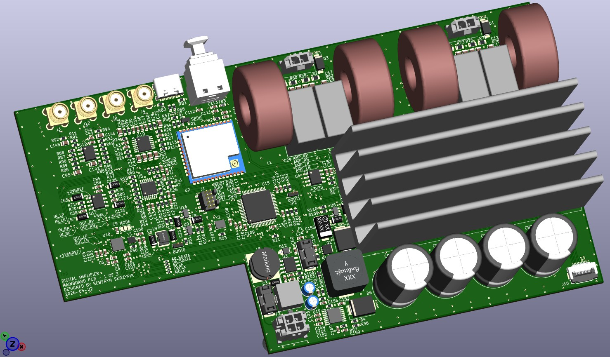
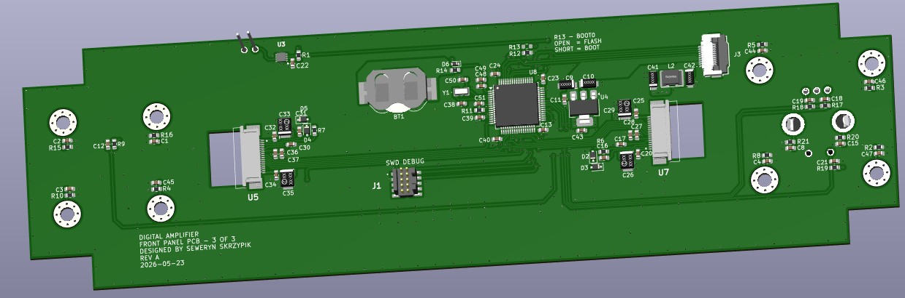
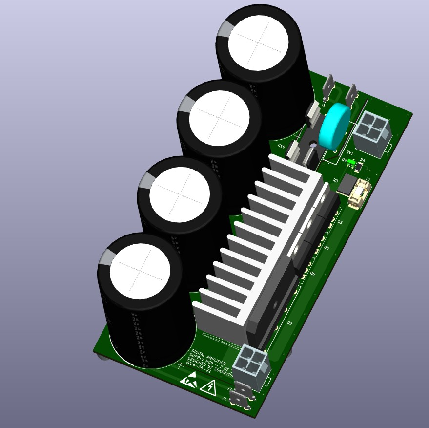
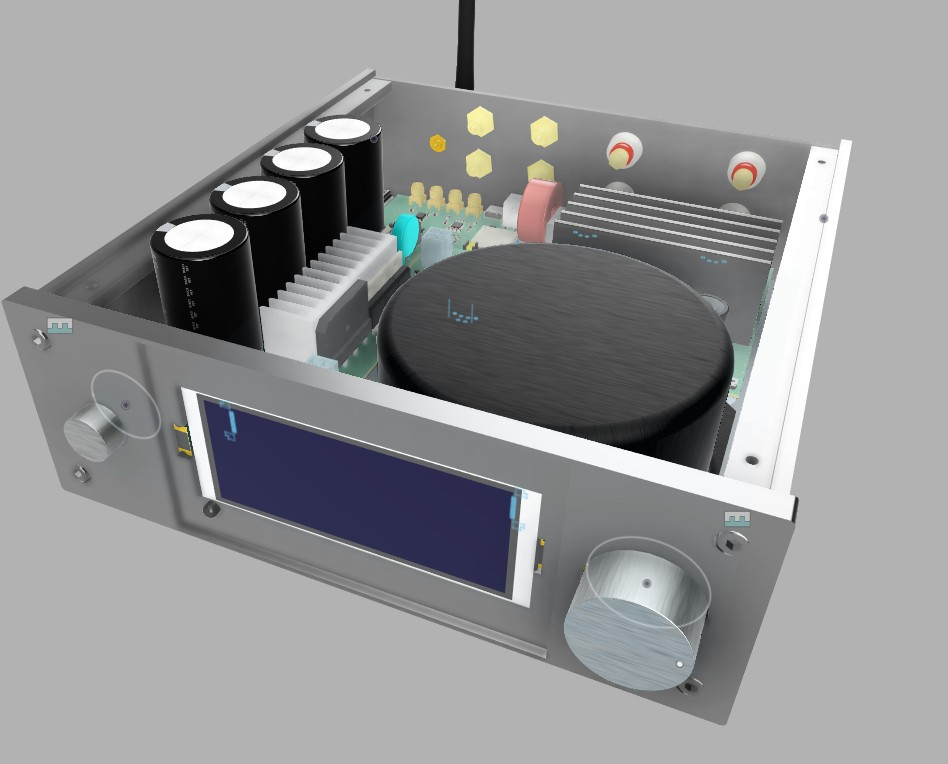

# DigitalAmplifier

High-performance Class-D audio amplifier project based on the TPA3255 platform with Post-Filter Feedback (PFFB), combined with a dedicated DSP subsystem powered by STM32F446.

The amplifier is designed as a fully integrated stereo solution delivering **2x75W output power**, with emphasis on:
- low distortion,
- high efficiency,
- modular hardware architecture,
- robust power delivery and protection systems.

---

# Main Features

- Class-D topology based on TPA3255
- Post-Filter Feedback (PFFB) architecture
- DSP processing using STM32F446
- 2x75W RMS output power
- Modular internal architecture
- Aluminum enclosure with glass front panel
- 3.83" OLED display
- IR remote control support
- RCA line input
- PREOUT output
- USB Type-C input
- S/PDIF input
- THD+N: TBD after laboratory measurements
- IMD: TBD after laboratory measurements

---

# Hardware Overview

## Amplifier PCB


## Front Panel PCB


## Power Supply PCB


---

# Complete Amplifier Assembly



---

# Project Status

Current development progress:
- [x] First hardware iteration completed
- [ ] CAD model finalization
- [ ] Mechanical integration
- [ ] Firmware and DSP implementation
- [ ] Thermal validation
- [ ] EMC validation
- [ ] ESD robustness testing
- [ ] Full system testing

---

# Technologies Used

- KiCad
- STM32CubeIDE
- LTspice
- ARM Cortex-M4 Embedded C
- DSP simulation in Python
- Autodesk Fusion

---

# Repository Structure

```text
DigitalAmplifier/
├── hardware/
├── firmware/
├── spice/
└── README.md
```
