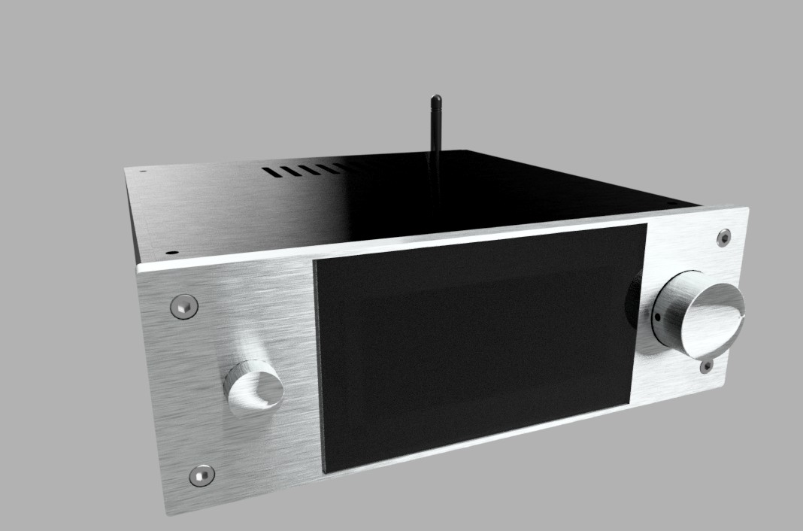
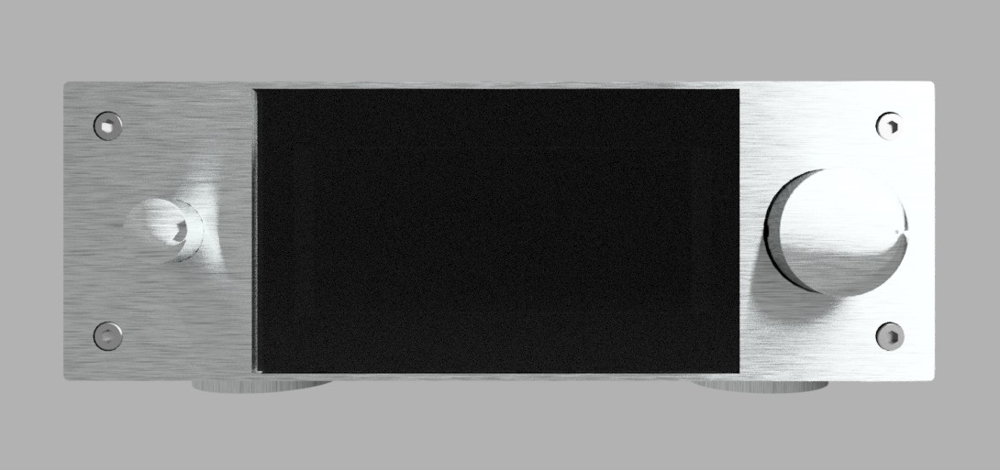
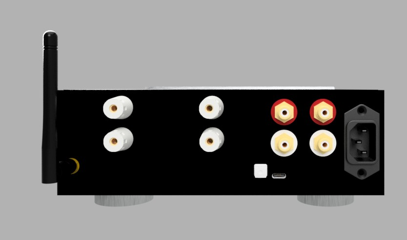
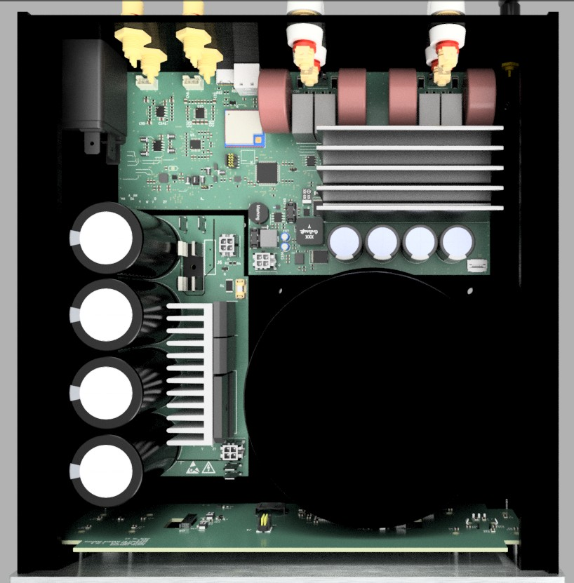
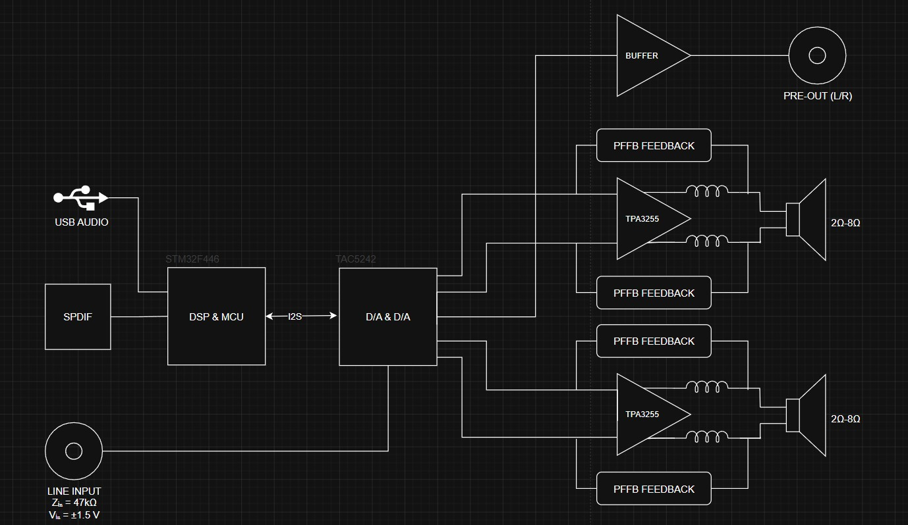
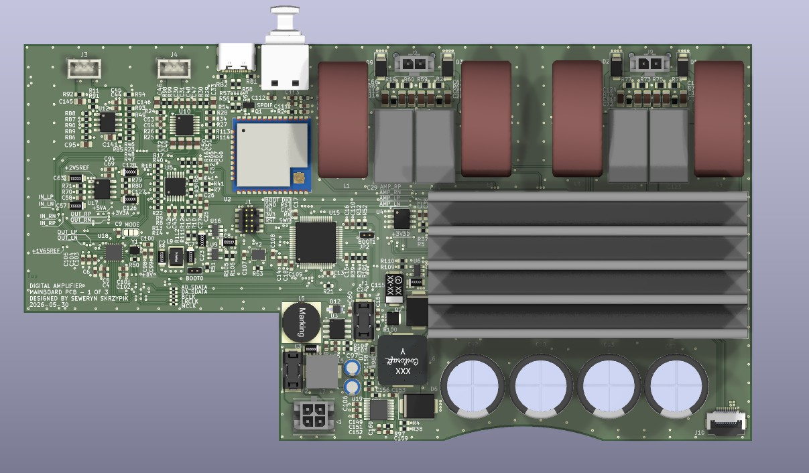
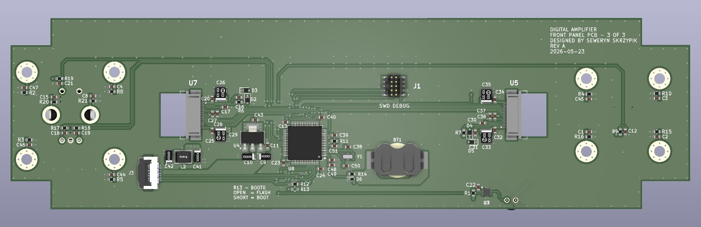
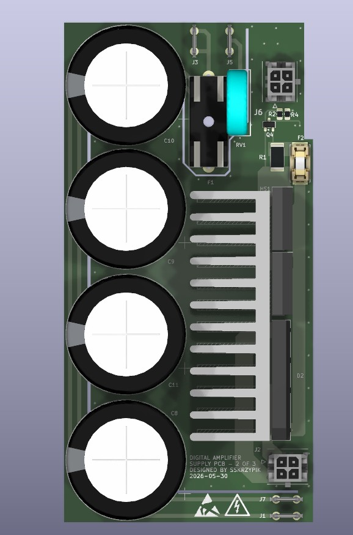

# DigitalAmplifier

High-performance Class-D audio amplifier project based on the TPA3255 platform with Post-Filter Feedback (PFFB), combined with a dedicated DSP subsystem powered by STM32F446.

The project aims to deliver a compact and fully integrated stereo amplifier capable of 2×75 W output power while combining modern digital signal processing with high audio performance and efficient power conversion.
---


# Main Features

## Audio & Electronics

- Class-D topology based on TPA3255
- Post-Filter Feedback (PFFB) architecture
- DSP processing using STM32F446
- 2×75 W RMS output power
- THD+N: TBD after laboratory measurements
- IMD: TBD after laboratory measurements

## Connectivity & User Interface

- USB Type-C input
- S/PDIF input
- RCA line input
- PREOUT output
- 3.83" OLED display
- IR remote control

## Mechanical Design

- Aluminum enclosure
- Glass front panel

---

# Hardware Overview

### Front View





### Rear View



### Internal View (Cover Removed)



## System Architecture



## Printed Circuit Boards

### Main Amplifier PCB



### Front Panel PCB



### Power Supply PCB




# Project Status

Current development progress:
- [x] First hardware iteration completed
- [ ] CAD model finalization
- [ ] Mechanical integration
- [ ] Firmware and DSP implementation
- [ ] Thermal validation
- [ ] EMC validation
- [ ] ESD robustness testing
- [ ] Full system testing

---

# Technologies Used

- KiCad
- STM32CubeIDE
- LTspice
- ARM Cortex-M4 Embedded C
- DSP simulation in Python
- Autodesk Fusion

---

# Repository Structure

```text
DigitalAmplifier/
├── hardware/
├── firmware/
├── spice/
└── README.md
```

---


# Support the Project

After building and validating a fully functional prototype, I plan to expand the project with an integrated audio streamer based on a Cortex-A35 processor running Linux or Android. This will enable music playback from services such as YouTube, Spotify, and TIDAL.

I would also like to further refine the industrial design, giving the amplifier a more modern and polished appearance.

The project is developed as Open Source from the very beginning, with a strong focus on quality, attention to detail, and long-term development.

If you would like to support my work and contribute to the project's future development, you can buy me a coffee:

<a href="https://buycoffee.to/sskrzypik03" target="_blank"></a>

☕ http://buycoffee.to/sskrzypik03


# Credits

Special thanks to [@vivadela](https://github.com/vivadela) for valuable support with the CAD design and mechanical development of the project.
---
